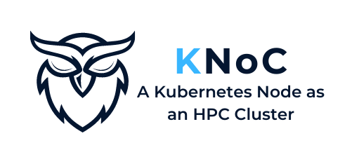
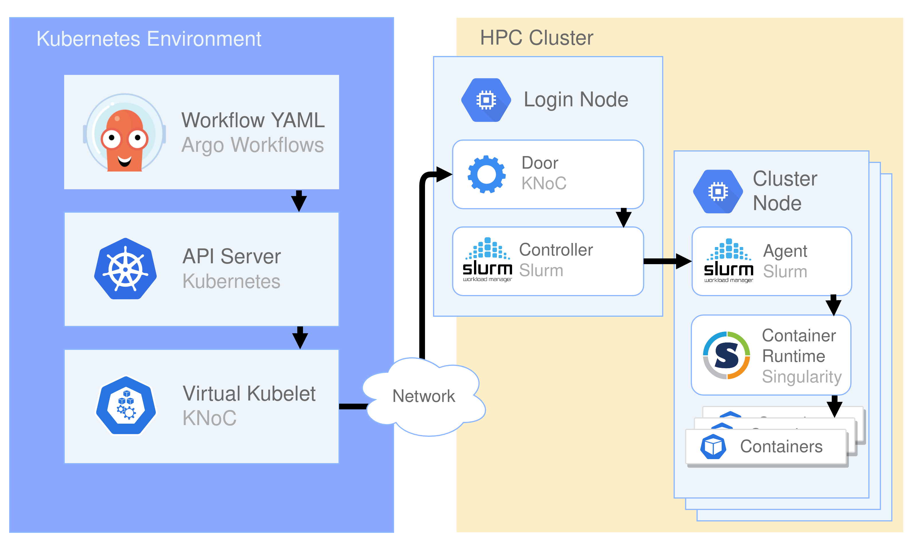

# KNoC - A Kubernetes Node to manage container lifecycle on HPC clusters
<!-- 
<picture>
  <source media="(prefers-color-scheme: dark)" srcset="media/darkcrop.png">
  <source media="(prefers-color-scheme: light)" srcset="media/lightcrop.png">
  
</picture> -->

KNoC is a [Virtual Kubelet](https://github.com/virtual-kubelet/virtual-kubelet) Provider implementation that manages real pods and containers in a remote container runtime by supporting the lifecycle management of pods, containers and other resources in the context of Kubernetes.

[Virtual Kubelet](https://github.com/virtual-kubelet/virtual-kubelet) is an open source [Kubernetes](https://kubernetes.io/) kubelet implementation that masquerades as a kubelet for the purposes of connecting Kubernetes to other APIs.

Remote environments include [Singularity](https://sylabs.io/singularity/) container runtime utilizing [Slurm's](https://slurm.schedmd.com/) resource management and job scheduling

## Features
- Create, delete and update pods
- Container logs and exec
- Get pod, pods and pod status
- Support for EmptyDirs, Secrets and ConfigMaps

## Installation
You can find all relative information in [INSTALL](https://github.com/CARV-ICS-FORTH/KNoC/blob/master/INSTALL.md).

## Acknowledgements

We thankfully acknowledge the support of the European Commission and the Greek General Secretariat for Research and Innovation under the European High-Performance Computing Joint Undertaking (JU) through projects EUROCC (GA-951732), DEEP-SEA (GA-955606), and EUPEX (GA-101033975). The JU receives support from the European Union's Horizon 2020 research and innovation programme and France, Germany, Italy, Greece, United Kingdom, the Czech Republic, and Croatia. National contributions from the involved state members (including the Greek General Secretariat for Research and Innovation) match the JU's funding.
